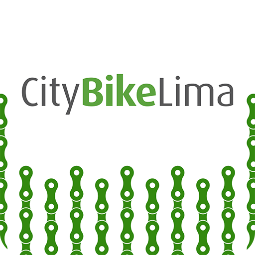

# Universidad Peruana de Ciencias Aplicadas  
### INFORME DEL TRABAJO 1 (TB1)
 </img> 

**Curso:** Aplicaciones Web

**Sección:** SI92

**Profesor:** Naldo Reupo-Musayon Gastulo

**Carrera:** Ingeniería de Software

**Ciclo:** 2024-02

**Startup:** CiberMach

**Producto:** MoviRent

### Integrantes:

| Nombre                             | Código       |
|------------------------------------|--------------|
| Adriana María Diestra Zambrano | u202218110 |
| Bárbara Antonella Espinoza Delgado | u201911727 |
| Mathias Adriano Hidalgo Lopez | u202213222 |
| Nestor Hernan Velarde Gonzales | u20211C221 |
| Quique Vladimir Jara Benites | u202022365 |
| Roy Linsh Fernandez Remon | u20221B778 |

 

# Project Report Collaboration Insights
TB1: Las tareas asignadas para la entrega TB1 se han completado y están documentadas en el siguiente repositorio de Github perteneciente a la organización del equipo:

Durante la preparación del informe, se llevaron a cabo las siguientes actividades:
- Se escribieron y graficaron los contenidos asignados a cada miembro en formato Markdown, seguido de commits para monitorear el progreso de cada integrante en el repositorio. 
- Se crearon los artefactos necesarios utilizando las herramientas indicadas en el PDF del proyecto. 
- Se organizaron reuniones para asignar las tareas, para coordinar el progreso de los elementos del informe y para comunicar los avances del primer Sprint.

 

# Contenido 
## Tabla de contenidos
### [Registro de versiones del informe](#registro-de-versiones-del-informe)
### [Project Report Collaboration Insights](#project-report-collaboration-insights)
### [Student Outcome](#student-outcome)
## [Capítulo I: Introducción](#capítulo-i-introducción)
- [1.1. Startup Profile](#11-startup-profile)
  - [1.1.1. Descripción de la Startup](#111-descripción-de-la-startup)
  - [1.1.2. Perfiles de integrantes del equipo](#112-perfiles-de-integrantes-del-equipo)
- [1.2. Solution Profile](#12-solution-profile)
  - [1.2.1 Antecedentes y problemática](#121-antecedentes-y-problemática)
  - [1.2.2 Lean UX Process](#122-lean-ux-process)
    - [1.2.2.1. Lean UX Problem Statements](#1221-lean-ux-problem-statements)
    - [1.2.2.2. Lean UX Assumptions](#1222-lean-ux-assumptions)
    - [1.2.2.3. Lean UX Hypothesis Statements](#1223-lean-ux-hypothesis-statements)
    - [1.2.2.4. Lean UX Canvas](#1224-lean-ux-canvas)
- [1.3. Segmentos objetivo](#13-segmentos-objetivo)

## [Capítulo II: Requirements Elicitation & Analysis](#capítulo-ii-requirements-elicitation--analysis)
- [2.1. Competidores](#21-competidores)
  - [2.1.1. Análisis competitivo](#211-análisis-competitivo)
  - [2.1.2. Estrategias y tácticas frente a competidores](#212-estrategias-y-tácticas-frente-a-competidores)
- [2.2. Entrevistas](#22-entrevistas)
  - [2.2.1. Diseño de entrevistas](#221-diseño-de-entrevistas)
  - [2.2.2. Registro de entrevistas](#222-registro-de-entrevistas)
  - [2.2.3. Análisis de entrevistas](#223-análisis-de-entrevistas)
- [2.3. Needfinding](#23-needfinding)
  - [2.3.1. User Personas](#231-user-personas)
  - [2.3.2. User Task Matrix](#232-user-task-matrix)
  - [2.3.3. User Journey Mapping](#233-user-journey-mapping)
  - [2.3.4. Empathy Mapping](#234-empathy-mapping)
  - [2.3.5. As-is Scenario Mapping](#235-as-is-scenario-mapping)
- [2.4. Ubiquitous Language](#24-ubiquitous-language)

## [Capítulo III: Requirements Specification](#capítulo-iii-requirements-specification)
- [3.1. To-Be Scenario Mapping](#31-to-be-scenario-mapping)
- [3.2. User Stories](#32-user-stories)
- [3.3. Impact Mapping](#33-impact-mapping)
- [3.4. Product Backlog](#34-product-backlog)

## [Capítulo IV: Product Design](#capítulo-iv-product-design)
- [4.1. Style Guidelines](#41-style-guidelines)
  - [4.1.1. General Style Guidelines](#411-general-style-guidelines)
  - [4.1.2. Web Style Guidelines](#412-web-style-guidelines)
- [4.2. Information Architecture](#42-information-architecture)
  - [4.2.1. Organization Systems](#421-organization-systems)
  - [4.2.2. Labeling Systems](#422-labeling-systems)
  - [4.2.3. SEO Tags and Meta Tags](#423-seo-tags-and-meta-tags)
  - [4.2.4. Searching Systems](#424-searching-systems)
  - [4.2.5. Navigation Systems](#425-navigation-systems)
- [4.3. Landing Page UI Design](#43-landing-page-ui-design)
  - [4.3.1. Landing Page Wireframe](#431-landing-page-wireframe)
  - [4.3.2. Landing Page Mock-up](#432-landing-page-mock-up)
- [4.4. Web Applications UX/UI Design](#44-web-applications-uxui-design)
  - [4.4.1. Web Applications Wireframes](#441-web-applications-wireframes)
  - [4.4.2. Web Applications Wireflow Diagrams](#442-web-applications-wireflow-diagrams)
  - [4.4.3. Web Applications Mock-ups](#443-web-applications-mock-ups)
  - [4.4.4. Web Applications User Flow Diagrams](#444-web-applications-user-flow-diagrams)
- [4.5. Web Applications Prototyping](#45-web-applications-prototyping)
- [4.6. Domain-Driven Software Architecture](#46-domain-driven-software-architecture)
  - [4.6.1. Software Architecture Context Diagram](#461-software-architecture-context-diagram)
  - [4.6.2. Software Architecture Container Diagrams](#462-software-architecture-container-diagrams)
  - [4.6.3. Software Architecture Components Diagrams](#463-software-architecture-components-diagrams)
- [4.7. Software Object-Oriented Design](#47-software-object-oriented-design)
  - [4.7.1. Class Diagrams](#471-class-diagrams)
  - [4.7.2. Class Dictionary](#472-class-dictionary)
- [4.8. Database Design](#48-database-design)
  - [4.8.1. Database Diagram](#481-database-diagram)

## [Capítulo V: Product Implementation, Validation & Deployment](#capítulo-v-product-implementation-validation--deployment)
- [5.1. Software Configuration Management](#51-software-configuration-management)
  - [5.1.1. Software Development Environment Configuration](#511-software-development-environment-configuration)
  - [5.1.2. Source Code Management](#512-source-code-management)
  - [5.1.3. Source Code Style Guide & Conventions](#513-source-code-style-guide--conventions)
  - [5.1.4. Software Deployment Configuration](#514-software-deployment-configuration)
- [5.2. Landing Page, Services & Applications Implementation](#52-landing-page-services--applications-implementation)
  - [5.2.1. Sprint 1](#521-sprint-1)
    - [5.2.1.1. Sprint Planning 1](#5211-sprint-planning-1)
    - [5.2.1.2. Sprint Backlog 1](#5212-sprint-backlog-1)
    - [5.2.1.3. Development Evidence for Sprint Review](#5213-development-evidence-for-sprint-review)
    - [5.2.1.4. Testing Suite Evidence for Sprint Review](#5214-testing-suite-evidence-for-sprint-review)
    - [5.2.1.5. Execution Evidence for Sprint Review](#5215-execution-evidence-for-sprint-review)
    - [5.2.1.6. Services Documentation Evidence for Sprint Review](#5216-services-documentation-evidence-for-sprint-review)
    - [5.2.1.7. Software Deployment Evidence for Sprint Review](#5217-software-deployment-evidence-for-sprint-review)
    - [5.2.1.8. Team Collaboration Insights during Sprint](#5218-team-collaboration-insights-during-sprint)
  
- [5.3. Validation Interviews](#53-validation-interviews)
  - [5.3.1. Diseño de entrevistas](#531-diseño-de-entrevistas)
  - [5.3.2. Registro de entrevistas](#532-registro-de-entrevistas)
  - [5.3.3. Evaluación según heurísticas](#532-evaluación-según-heurísticas)

- [5.4. Video about the product](#54-video-about-the-product)

## [Conclusiones](#conclusiones)
- [Conclusiones y Recomendaciones](#conclusiones-y-recomendaciones)
- [Video about the team](#video-about-the-team)

## [Bibliografía](#bibliografía)
## [Anexos](#anexos)

---

# Capítulo I: Introducción
## 1.1. Startup Profile

### 1.1.1. Descripción de la Startup
Somos CiberMach, un startup conformado por 6 estudiantes de la Universidad Peruana de Ciencias Aplicadas (UPC), que trabajará en el desarrollo del producto MoviTech, dedicada a facilitar el alquiler de scooters eléctricos. Nuestro enfoque se centra en brindar soluciones tanto para usuarios que buscan alquilar scooters para fines de transporte como para personas que tienen un scooter y buscan generar ganacias alquilandolo, nuestro objetivo es facilitar el acceso a scooters eléctricos de forma segura y conveniente para nuestros usuarios, nuestro sitio web ofrece una experiencia excepcional, garantizando la disponibilidad y seguridad  de sus scooters.  

**Misión:** Transformar la movilidad urbana y recreativa con un acceso conveniente, económico y seguro a scooters eléctricos.  
**Visión:** Ser líderes en el mercado de desarrollo de aplicaciones orientadas al cuidado del medio ambiente.  
**Valores:**
- Innovación: La innovación constante para ofrecer soluciones creativas.
- Calidad: Buscamos la exelencia en nuestro producto.  
### 1.1.2. Perfiles de integrantes del equipo

## 1.2. Solution Profile

### 1.2.1. Antecedentes y problemática
Nuestra capital Lima, es una de las ciudades con mayor tráfico del mundo, lo que genera grandes costos económicos para las millones de personas que transitan diariamente por la ciudad de lima y callao, el sistema de transporte se encuentran notablemente retrasados. En el 2023 nuestra ciudad de Lima pasó del quinto al segundo país en el ranking de ciudades con mayor tráfico a nivel mundial. Según TomTom Traffic, trasladarse 10 kilómetros (distancia entre plaza San Martín y el Óvalo Naranjal al norte o al Larcomar al sur) demora 24 a 30 minutos en promedio.  

**What (Qué)**  
El problema identificado radica en el tráfico de Lima, que es uno de los más congestionados del mundo, generando costos económicos significativos y afectando la calidad de vida de millones de personas.  

**When (Cuándo)** ¿Cuándo estamos viendo el problema?  

El problema del tráfico se experimenta diariamente, especialmente durante las horas pico de la mañana y la tarde, afectando los desplazamientos laborales y personales.  

**Where (Dónde)** ¿Dónde estamos viendo los problemas?  

El tráfico congestionado se encuentra generalmente en las avenidas principales, intersecciones críticas y puntos de entrada y salida de la ciudad.  

**Who (Quiénes)** ¿A quien le sucede?  

El problema afecta a todos los residentes y usuarios de Lima, que dependen del transporte terrestre para sus actividades diarias, incluidos trabajadores, estudiantes y visitantes.  

**Why (Por qué)** ¿Por qué sucede el problema?  

La congestion vehicular se debe a una combinación de factores, como el crecimiento poblacional desmedido, la falta de infraestructura vial adecuada, el aumento del parque automotor, la falta de sistemas de transporte público eficientes y sobre todo el desconocimiento de transportes alternativos.  

**How (Cómo)** ¿Cómo se diferencia el problema del estado normal?  

Como una congestión constante en las vías principales, causando retrasos significativos en los tiempos de viaje y aumentando el estrés y la frustración de los usuarios. La congestión tiende a empeorar durante las horas pico y en días laborables.

**How much (Cuánto)** ¿Cuánto dinero están implicando?  

La congestión vehicular causa un impacto diario a millones de personas, provocando retraso en sus actividades diarias, pérdida de productividad y el aumento en el coste de transporte que asciende a mas de 500 soles anuales por manejar en horas pico o la alza de pasajes en el transporte público que a aumentado en casi 100 soles mensuales desde 2010.

### 1.2.2. Lean UX Process

#### 1.2.2.1. Lean UX Problem statements  
En el estado actual de el alquiler de vehiculos menores, se ha centrado principalmente en los usuarios que necesitan un transporte alternativo con garantia o usuarios que deseen generar un ingreso extra alquilando sus vehiculos.  

Lo que los servicios existentes no logran abordan es el seguimiento de uso, cobertura amplia y la posbilidad de obtener un ingreso de dinero adicional.  

Nuestro servicio abordará esta brecha al ofrecer un producto web enfocado en el alquiler de scooters eléctricos.  

Nuestro enfoque inicial será el segmento de personas que desean alquilar un scooter para sus actividades diarias o recreativas.  

Sabremos que tenemos éxito cuando veamos una reducción en el gasto mensual de transporte de nuestros usuarios de un 30% y una reducción de tiempo de al menos 5 horas semanales.  

#### 1.2.2.2. Lean UX Assumptions

**Features**  

- Herramientas de Colaboración: Funcionalidades que faciliten el alquiler de un scooter eléctrico.  
- Sistema de Monetización Transparente: Opciones claras y justas para que los arrendadores puedan ganar ingresos.  
- Listado de scooters disponibles: Un amplio catálogo de scooters disponibles para ser alquilados.  
- Perfil de Usuario: Perfiles personalizables para que los usuarios se identifiquen.  
- Soporte para Dispositivos Múltiples: Accesibilidad desde cualquier dispositivo.  

**Bussiness Outcomes**  

Utilizando la tecnica de Metrics Mountain se obtuvo lo siguiente:
1. Adquisición:  
Porcentaje de nuevos usuarios registrados como arrendatarios que se suscriben a un plan mensual.
Porcentaje de propietarios que publican al menos un vehiculo en la plataforma

2. Activación:  
Porcentaje de usuarios que completan el proceso de reserva de un vehiculo en los primeros 7 dias de registro.
Porcentaje de vehiclulos registrados que reciben al menos una solicitud de alquiler.

3. Retención:  
Porcentaje de usuarios que realizan al menos 3 solicitudes de alquiler por semana.
Porcentaje de propietarios que mantienen al menos un vehiculo activo en la plataforma durante tres meses consecutivos.

4. Ingresos:
Ingresos mensuales por suscripciones de arrendatarios.
Ingresos mensuales por comisiones de alquiler.

5. Impacto Social Positivo:
Contribuir a la sociedad fomentando el uso de un transporte eco-amigable.

Usando estas métricas se evaluaron los siguientes outcomes:  

- Aumento en el número total reservas por parte de nuevos usuarios.
- Mejora en la utilización de vehículos, reduciendo los períodos de inactividad y aumentando la rentabilidad por vehículo.
- Lograr un crecimiento significativo en los ingresos mensuales por suscripciones de arrendatarios y comisiones de alquiler.  
- Reducir al menos en un 30% el tiempo de viaje diario de los usuarios.  

**Users**  
Los usuarios de la plataforma serán principalmente arrendadores de scooters eléctricos que buscan generar un ingreso económico extra, así como arrendatarios que buscan alquilar un scooter eléctrico por horas o dias para transportarse de manera más rapida y económica.  

**User outcomes**  

**Cliente:**  

¿Qué está intentando lograr el usuario?  
Reducir el tiempo y el estrés asociados con los desplazamientos diarios en Lima, así como ahorrar dinero en transporte para destinarlo a otros gastos.  

¿Cómo quiere sentirse el usuario durante y después de este proceso?  
Desea sentirse aliviado y menos estresado durante sus viajes diarios, así como satisfecho por haber encontrado una solución económica y confiable para sus necesidades de transporte.  

¿Cómo acerca nuestro producto o servicio al usuario a una meta o sueño de vida?  
Nuestro servicio de transporte le permite al usuario ahorrar tiempo y dinero, contribuyendo a una mayor eficiencia en su vida diaria y liberando recursos para otros aspectos de su vida.  

¿Por qué buscaría su usuario su producto?  
El usuario busca nuestro producto porque valora la economía, y está interesado en soluciones que reduzcan el tiempo y el estrés al movilizarse.  

¿Qué cambio de comportamiento podemos observar que indique que han logrado su objetivo?  
Utiliza regularmente nuestro servicio de alquiler de scooters eléctricos para sus desplazamientos diarios, experimentando una disminución en el tiempo de viaje y una mayor sensación de calma y comodidad durante sus trayectos.   

 

**Owner:**  

¿Qué está intentando lograr el usuario?  
Busca generar ingresos adicionales mediante el alquiler de sus scooters eléctricos para maximizar su inversión.  

¿Cómo quiere sentirse el usuario durante y después de este proceso?  
Desea sentirse seguro y confiado en la gestión del proceso de alquiler, así como satisfecho con el incremento de sus ingresos mensuales como resultado de esta actividad.  

¿Cómo acerca nuestro producto o servicio al usuario a una meta o sueño de vida?  
Nuestra plataforma de alquiler le permite al usuario maximizar el valor de sus activos, brindándole una oportunidad rentable para generar ingresos adicionales y alcanzar sus objetivos financieros.  

¿Por qué buscaría su usuario su producto?  
Busca nuestra plataforma de alquiler porque valora la seguridad, confiabilidad y soporte que proporcionamos, así como nuestra capacidad para proteger la integridad de sus activos y garantizar una experiencia positiva para sus arrendatarios.  
¿Qué cambio de comportamiento podemos observar que indique que han logrado su objetivo?  
Experimenta un aumento en sus ingresos mensuales como resultado del alquiler de sus scooters, y se siente seguro y confiado en la gestión del proceso de alquiler a través de nuestra plataforma.  

**User assumptions**  

¿Quién es el usuario?  
El usuario puede ser cualquier persona interesada en alquilar un scooter eléctrico o una persona que busque dar en alquiler un scooter.  

¿Dónde encaja nuestro producto en sus trabajos o vidas?  
Nuestro producto se integra en la vida de los usuarios como una plataforma digital que facilita el alquiler de scooters eléctricos. Para los arrendadores es una plataforma para dar en alquiler sus scooters y generar ingresos extra. Para los los arrendatarios es una plataforma donde podrán tener una amplia lista de scooters en alquiler para poder elegir el que mejor se adecue a sus necesidades y presupuesto.

¿Qué problema resuelve nuestro producto?  
Nuestro producto aborda varios problemas:

Pérdida de tiempo en el tráfico: Proporciona una plataforma donde las personas pueden alquilar scooters eléctricos y poder transportarse de manera rapida y económica.  
Búsqueda de ingresos extra: Aborda la dificultad que tienen las personas hoy en día para tener ingresos extras.

¿Cuándo y cómo es usado nuestro producto?  
Los arrendatarios usarán la plataforma cuando quieran poner en alquiler un scooter eléctrico.  
Los arrendadores la utilizarán para alquilar un scooter cuando lo necesiten.  

¿Qué características son importantes?  
- Registro de scooter: Funcionalidades para poner en alquiler un scooter.
- Búsqueda y Filtros: Funcionalidades para buscar scooters que se adecuen a las preferencias del usuario.

¿Cómo debería verse y comportarse nuestro producto?
- Diseño Limpio y Atractivo: Interfaz intuitiva con un enfoque en las fotos e información precisa .
- Facilidad de Uso: Navegación sencilla y procesos claros para cargar contenido.
- Transparencia en Compensación: Información clara sobre cómo se alquila un scooter.  

**Business Assumptions**  
1. Creemos que nuestros clientes necesitan una plataforma que les permita alquilar y dar en alquiler scooters eléctricos de manera rapida y sencilla. Los arrendadores buscan personas que alquilen sus scooters mientras que los arrendatarios buscan alquilar el scooter ideal para sus necesidades.

2. Estas necesidades se pueden resolver con una aplicación web que de alquiler de scooters eléctricos y permita a las personas dueñas de uno o más scooters obtengan un ingreso extra.  

3. El valor #1 que mi cliente quiere de mi servicio
   - Para los arrendadores: Una plataforma donde puedan encontrar diversias opciones de scooters eléctricos para alquilar.
   - Para los arrendatarios: Una plataforma que les permita dar en alquiler su scooter y ganar dinero extra.  

4. Voy a adquirir la mayoría de mis clientes la promoción activa en redes sociales, asociaciones con comunidades del cuidado del medio ambiente y la creación de contenido atractivo para atraer a nuestro público objetivo. 

5. Haré dinero a través de modelos de suscripción semanal, mensual o anual.  

6. Mi competencia principal en el mercado serán plataformas existentes como emove, grin4u y otras aplicaciones que den en alquiler transportes altermnativos incluidos scooters eléctricos. 

7. Los venceremos debido a la simplicidad de uso gracias a la interfaz intuitiva y procesos sencillos, facilitando la colaboración y la publicación y dando la oportunidad a los dueños de scooters de generar un ingreso extra.

8. El mayor riesgo es que no logremos una base de usuarios activa o no cumplamos con las expectativas de calidad y colaboración.  

9. Resolveremos esto a través de fomentar una comunidad activa, garantizar la remuneración a los arrendadores y estar en constante mejora de calidad de la aplicación.  

#### 1.2.2.3. Lean UX Hypothesis Statements
Utilizando los bussines outcomes, user outcomes y solutions se formularon las siguientes hipótesis:  

**Cliente:**  
**Creemos que** al simplificar el proceso de registro en nuestra plataforma, aumentaremos la cantidad de nuevos usuarios. **Sabremos que** hemos tenido éxito **cuando** observemos un aumento significativo en el número de cuentas creadas en los primeros 7 días después del lanzamiento.  

**Creemos que** al facilitar la información de cada scooter disponible, aumentaremos la cantidad de usuarios que alquilen un scooter. **Sabremos que** hemos tenido éxito **cuando** observemos un aumento significativo en el número de personas que pongan en alquiler sus scooters.  

**Owner:**  
**Creemos que** al simplificar el proceso de poner en alquiler un scooter en nuestra plataforma, aumentaremos la cantidad de arrendadores. **Sabremos que** hemos tenido éxito **cuando** observemos un aumento significativo en el número de scooters disponibles para alquilar en los primeros 7 días después del lanzamiento.  

#### 1.2.2.4. Lean UX Canvas

## 1.3. Segmentos Objetivo
Nuestros segmentos objetivo del proyecto propuesto son dos, acontinuación los presentamos:  

**Segmento 1** Segmento arrendatario (Owner): Aquellas personas interesadas formar parte de MoviTech, donde ellos podrán rentar su scooter disponible y conseguir un ingreso extra, tendrán la opción de registrar sus caracteristicas y validar si el equipo cumple con las condiciones para nuestro servicio.  

**Segmento 2** Segmento arrendador (User): Personas que desean optar un scooter eléctrico para fines de transporte sea hacia sus labores, universidades, fines deportivos u otros pero que no cuentan con el dinero necesario en el momento para comprar uno. Donde podrán optar por alquilar un scooter por horas a un precio muy accesible.

---

# Capítulo II: Requirements Elicitation & Analysis
## 2.1. Competidores

### 2.1.1. Análisis competitivo

<table>
  <tr>
    <th colspan="6" valign="top">Competitive Analysis Landscape</th>
  </tr>
  <tr>
    <td colspan="2" valign="top">¿Por qué llevar a cabo este análisis?</td>
    <td colspan="4" valign="top">El objetivo de este análisis es identificar las características de los competidores y encontrar maneras de diferenciarnos.</td>
  </tr>
  <tr>
    <td colspan="2" rowspan="2" valign="top">Startup y Competidores</td>
    <td valign="top">CAMBIAR</td>
    <td valign="top">City Bike</td>
    <td valign="top">Grin</td>
    <td valign="top">Emove</td>
  </tr>
  <tr>
<td valign="top"></td>
    <td valign="top"></td>
    <td valign="top"></td>
    <td valign="top"></td>

  </tr>
  <tr>
    <td rowspan="2" valign="top">Perfil</td>
    <td valign="top">Overview</td>
    <td valign="top">Servicio de alquiler de scooters para la ciudad de Lima metropolitana.</td>
    <td valign="top">Servicio de alquiler de bicicletas en Miraflores, Lima.</td>
    <td valign="top">Servicio de alquiler de scooters  para Lima metropolitana.</td>
    <td valign="top">Servicio de alquiler de vehículos, servicios de reparaciones, venta de equipos y accesorios.</td>

  </tr>
  <tr>
    <td valign="top">Ventaja competitiva ¿Qué valor ofrece a los clientes?</td>
    <td valign="top">Una plataforma que permite a los usuarios alquilar scooters por suscripción y a los propietarios ganar dinero al poner sus vehículos en alquiler. </td>
    <td valign="top">La forma de alquiler es mediante registros por plataforma web o móvil, la suscripción está disponible desde pase diario, mensual y anual. </td>
    <td valign="top">Permite a los usuarios alquilar mediante suscripción sus scooters. Además , ofrece mantenimiento gratuito.</td>
    <td valign="top">Permite a los usuarios el alquiler de vehículos, la compra y venta de accesorios nuevos como de segunda mano, a través de su sitio web. </td>
  </tr>
  <tr>
    <td rowspan="2" valign="top">Perfil de Marketing</td>
    <td valign="top">Mercado objetivo</td>
    <td valign="top">Personas de entre 18 y 35 años que requieren los servicios solo para ciudad de Lima y personas de entre 18 y 60 para el mantenimiento y alquiler</td>
    <td valign="top">Personas mayores a 18 años, para habitantes de Lima, visitantes y turistas. </td>
    <td valign="top">Personas mayores de 15 años que se deben movilizar por Lima Metropolitana diariamente.</td>
    <td valign="top">Personas mayores de 18 años que busquen promover los vehículos de micromovilidad.</td>
  </tr>
  <tr>
    <td valign="top">Estrategias de marketing</td>
    <td valign="top">Publicidad por redes sociales y vallas publicitarias en calles de mayor afluencia.</td>
    <td valign="top">Publicidad en redes sociales.</td>
    <td valign="top">Publicidad en redes sociales y afiches</td>
    <td valign="top">Publicidad en redes sociales.</td>
  </tr>
  <tr>
    <td rowspan="3" valign="top">Perfil de Producto</td>
    <td valign="top">Productos & Servicios</td>
    <td valign="top">Alquiler de vehículos menores</td>
    <td valign="top">Alquiler de bicicletas.</td>
    <td valign="top">Alquiler de scooters y mantenimiento.</td>
    <td valign="top">Alquiler de vehículos y servicio de reparaciones.</td>
  </tr>
  <tr>
    <td valign="top">Precios & Costos</td>
    <td valign="top">Planes de suscripción: 
    - Plan semanal: s/. 59 
    - Plan base: s/. 199 
    - Plan premium: s/. 499
    </td>
    <td valign="top">Planes de suscripción:  
- Diario: s/4.33     
- Mensual: s/19.50  
- Anual: s/ 151.73   
</td>
    <td valign="top">Planes de suscripción: 
- Mensual: S/. 139 
- Bimestral: S/239 
- Trimestral: S/329 
</td>
    <td valign="top">Costo de alquiler: 
- 2 horas: s/. 60 
- 4 horas: s/. 80 
- 1 día: s/. 120 
</td>
  </tr>
  <tr>
    <td valign="top">Canales de distribución (Web y/o Móvil)</td>
    <td valign="top">Principalmente a través de su sitio web oficial</td>
    <td valign="top">Principalmente a través de su sitio web, con posibilidad de acceso móvil. </td>
    <td valign="top">Principalmente a través de su sitio web oficial.</td>
    <td valign="top">Principalmente a través de su sitio web oficial.</td>
  </tr>
  <tr>
    <td rowspan="4" valign="top">Análisis SWOT</td>
    <td valign="top">Fortalezas</td>
    <td valign="top">
    	Modelo de negocio innovador que combina alquiler por suscripción y oportunidad para propietarios de generar ingresos adicionales.
    </td>
    <td valign="top">
      Posibilidad para personas que optan por un transporte eficiente y sano. 
    </td>
    <td valign="top">
        Base de clientes establecida, está presente en lugares con mayor afluencia de tráfico 
    </td>
    <td valign="top">
        -Variedad de servicios 
        -Movilidad sostenible 
        -Flexibilidad de precios 
    </td>
  </tr>
  <tr>
    <td valign="top">Debilidades</td>
    <td valign="top">
        Dependencia de la disponibilidad y mantenimiento de los vehículos por parte de los propietarios          
        No contamos con un sistema de rastreo sofisticado
    </td>
    <td valign="top">
        No cuenta con servicio de mantenimiento. 
    </td>
    <td valign="top">
        No cuenta con aplicación móvil, costos elevados. Poca publicidad
    </td>
    <td valign="top">
        -Dependencia tecnológica 
        -Competencia 
        -Costos de mantenimiento 
        -Dependencia climática 
    </td>
  </tr>
  <tr>
    <td valign="top">Oportunidades</td>
    <td valign="top">
        Es innovador y no afecta al medio ambiente. Asimismo, tiene un impacto positivo en la economía y salud de los usuarios.
    </td>
    <td valign="top">
        La ciudad de Miraflores cuenta con vías exclusivas para bicicletas y posibilidad para expandir a más distritos Limeños.
    </td>
    <td valign="top">
        Expandir su base de usuarios ya sea con mayor publicidad o mas alcance a zonas de cobertura del servicio.
    </td>
    <td valign="top">
        -Expansión de mercado 
        -Alianzas estratégicas 
        -Diversificación de servicios 
        -Tendencia de movilidad urbana 
    </td>
  </tr>
  <tr>
    <td valign="top">Amenazas</td>
    <td valign="top">
        Las personas no confían en el servicio
    </td>
    <td valign="top">
        Las invasiones de motorizados a ciclovías y los robos de equipos (bicicletas) en lugares con poca seguridad. 
    </td>
    <td valign="top">
        Cambios en la regulación del transporte.
    </td>
    <td valign="top">
        Cambios en la regulación, críticas negativas y avances tecnológicos representan amenazas potenciales para la operación y la reputación de Samma en el mercado.
    </td>
  </tr>
</table>

### 2.1.2. Estrategias y tácticas frente a competidores

* Aprovecha la oportunidad de expandir nuestro servicio a otras áreas metropolitanas y turísticas, más allá de la ubicación actual de nuestros competidores. Esto nos permitirá alcanzar a una base de usuarios más amplia y capturar nuevos mercados.
* Incluir a nuestro producto características como busqueda por zonas, notificaciones en tiempo real sobre disponibilidad de vehículos y opciones de pago seguras.

## 2.2. Entrevistas
### 2.2.1. Diseño de entrevistas

#### Entrevistas segmento 01: Owner
1. ¿Cual es tu nombre completo?
2. ¿Cuántos años tienes? ¿En que distrito resides actualmente?
3. ¿En que sector se desempeña laboralmente? ¿Que funciones realizas?
4. ¿Para trabajar que dispositivo se le hace mas comodo? ¿Que marca es?
5. ¿Que navegador web prefiere utilizar en su dia a dia y por qué?
6. ¿Que medios informativos usa con mayor frecuencia? ¿Y de entretenimiento?
7. ¿Hace cuantos años te dedicas a rentas sus vehiculos?
8. ¿Que estrategia de marketing haces a las personas nuevas para que te alquilen tu vehiculo?
9. ¿Como manejas las tarifas para tus vehiculos?
10. ¿Cómo te gustaría que sean las tarifas de alquiler?
11. ¿Manejas algún limite o reglas para las personas que te alquilan?
12. ¿Como te contactas con tus clientes o personas quienes te alquilan?
13. ¿Que haces cuando tu vehiculo se malogra?
14. ¿Tienes un límite de tiempo o distancia para el alquiler?
15. ¿Usualmente, que equipos electrónicos usas con mayor frecuencia?
16. Según nuestro proyecto mensionado, ¿Que te parece la idea?
17. ¿Usarías nuestra aplicación web?
18. ¿Qué te parecería poder visualizar la identidad del cliente?
19. ¿Qué te parecería poder visualizar el historial de rentas del cliente?
20. ¿Qué medidas de seguridad deben tener en cuenta los usuarios al usar los vehículos?
21. ¿Cuentas con algún tipo de seguro?
22. ¿Te gustaría que ofrezcamos algún tipo de seguro?
23. ¿Dónde te gustaría entregar tus vehículos?
24. ¿Cuáles son tus expectativas en cuanto a la cantidad de reservas a través de la aplicación?
25. ¿Con qué frecuencia te gustaría alquilar tus vehículos?
26. ¿Hay alguna mejora o característica adicional que te gustaría ver en la aplicación en el futuro?

#### Entrevistas segmento 2: Client
1. ¿Cual es tu nombre? ¿Cuántos años tienes? ¿Dónde vives actualmente? ¿A qué te dedicas?
2. ¿Qué dispositivos de escritorio usas mayormente? ¿Y de móvil? ¿Por que? ¿Que marca es?
3. ¿Que navegador web prefiere utilizar en su dia a dia y por qué?
4. ¿Que medios informativos usa con mayor frecuencia? ¿Y de entretenimiento?
5. ¿Qué medios de transporte utilizas con mayor frecuencia?
6. ¿Cuánto tiempo dedicas a desplazarte en el transporte diariamente?¿Qué tipo de transporte es?
7. ¿Cuáles son los mayores desafíos que enfrentas con tu transporte actual?
8. ¿Cuánto dinero aproximadamente gasta al mes en transporte convencional?¿Qué tan satisfecho estás con el servicio que este te ofrece?
9. ¿Qué te parecería contar con un servicio de vehículos alternativos como las bicicletas o scooters?
10. ¿Qué tipo de vehículos preferirías alquilar (bicicletas, scooters, patinetas eléctricas, etc.)?
11. ¿Qué aspectos consideras más importantes al elegir un servicio de alquiler de vehículos?
12. ¿Estarías dispuesto(a) a pagar una suscripción mensual por este servicio?
13. ¿Qué te parece la idea de incluir el mantenimiento del vehículo en la suscripción?
14. ¿Crees que este servicio podría ayudarte a reducir tus costos mensuales de transporte y el tiempo perdido en el tráfico?
15. ¿Con qué frecuencia crees que utilizarías este servicio de alquiler de vehículos?
16. ¿Qué tan importante es para ti la disponibilidad de vehículos en distintos puntos de la ciudad?
17. ¿Hay alguna mejora o característica adicional que te gustaría ver en la aplicación en el futuro?

### 2.2.2 Registro de entrevistas.

En esta sección se presentan las entrevistas realizadas a los segmentos objetivo.

### Entrevistas segmento 1: Owners
### Entrevista 1:

* Nombres: 
* Apellidos: 
* Edad: 34
* Distrito: Barranco
* Enlace a la entrevista: 
* Inicio de entrevista:
* Duración de la entrevista: 

   

**Informe del resumen de la entrevista:**

Entrevistado es un adulto de 34 años que vive en Barranco, actualmente trabaja en el sector empresarial, cumple la funcion de supervisor del area de logistica en tiendas metro. Sus sistemas operativos de preferencia son android en moviles y windows en ordenadores. El navegador que usa con mayor frecuencia es chrome, tiene preferencia por la marca samsung y lenovo. Sus canales informativos favoritos son television y facebook. Asimismo, para entretenimiento usa tiktok e instagram. El cuenta actualmente con un vehículo motorizado y una bicicleta, a el le gustaria alquilar vehiculos menores tomando en cuenta el precio de los vehículos y le gustaría cobrar por hora, el no cuenta con una experiencia previa pero le gustaría entrar en este sector. El nos comenta que sería bueno que la aplicación cuente con un sistema de tarifas que se ofrezcan a los owners por sus vehículos y que cuente con un sector de análisis de mercado, en el cual se muestre cuales son los vehículos con más demanda para quizás, en un futuro, poder invertir. Además, nos comenta que sería bueno que se limite el rango de uso del vehículo, osea, que este dentro de un límite de distancia al sector donde se alquila. El también estaría de acuerdo con que la aplicación cubra los gastos de mantenimiento y que la aplicación pueda mostrar quien es el cliente y cuál es su historial. A él le gustaría que la aplicación sea intuitiva para el owner y el usuario para su fácil manejo.

### Entrevista 2:

* Nombres: David
* Apellidos: Beltran Burgos
* Edad: 23
* Distito: San Borja
* Enlace a la entrevista: 
* Inicio de entrevista: 11:24
* Duración de la entrevista: 05:51

   

**Informe del resumen de la entrevista:**

David Beltrán un joven de 23 años, residente de San Borja. Actualmente trabaja en el sector financiero, sus funciones las cumple en el departamento de cobranzas del BCP. Sus sitemas operativos de preferencia son IOS en moviles y windows en ordenadores. El navegador que usa con mayor frecuencia es chrome. Tiene preferencia por la marca Apple y lenovo. Su canal informativo favorito es Twitter y de entretenimiento instagram. Beltrán posee una bicicleta y un patinete eléctrico como vehículos menores y no tiene experiencia previa en el alquiler de estos. Considera que las tarifas de alquiler deberían depender del tiempo de uso de cada equipo y prefiere los pagos a través de transferencias bancarias o aplicativos móviles como YAPE o Plin. Sugiere que el límite de tiempo o distancia para el alquiler debería restringirse solo a Lima. En caso de daños durante el uso del vehículo, espera una compensación por parte de la empresa. Valora la posibilidad de visualizar la identidad y el historial de rentas de los clientes. Recomienda medidas de seguridad como el uso de casco y respetar las normas de tránsito. No tiene seguro vehicular y estaría interesado en que se le ofrezca uno. Prefiere entregar los vehículos en módulos con supervisión. Inicialmente, espera pocas reservas, pero prevé un aumento con el tiempo. Le gustaría alquilar sus vehículos a diario y considera útil tener un historial de mantenimiento y la capacidad de limitar el uso de ciertas rutas en la aplicación. La entrevista concluyó con la posibilidad de requerir feedback en el futuro y agradecimientos mutuos.

### Entrevista 3:

* Nombres: 
* Apellidos: 
* Edad: 34
* Distrito: San Borja
* Enlace a la entrevista: 
* Inicio de entrevista: 17:16
* Duración de la entrevista: 09:12

   

**Informe del resumen de la entrevista:**

, residente de San Borja. Actualmente trabaja en el sector de venta y poseedor de un scooter eléctrico. Sus sistemas operativos de preferencia son android para moviles y windows para ordenadores. Además, menciona que Google Chrome es el navegador que usa con mayor frecuencia. Eric menciona que su presupuesto para alquilar cada tipo de vehículo sería de 20 soles diarios. Tiene experiencia previa en el alquiler de vehículos por aplicaciones, incluyendo scooters y autos. Sugiere que las tarifas de alquiler de scooters podrían basarse en el tiempo recorrido por minuto. Prefiere medios de pago como billeteras electrónicas y pagos con tarjeta. Propone un límite de tiempo para el alquiler, con un máximo de 8 horas. En caso de daño durante el uso, espera un acuerdo que lo proteja como propietario del vehículo. Considera importante visualizar la identidad del cliente y recomienda medidas de seguridad como el uso de casco y luces. Está interesado en que la aplicación ofrezca un seguro para cubrir posibles daños y desgaste por el tiempo de uso. Prefiere entregar sus vehículos en su espacio laboral en San Borja. Estima que podría haber al menos 20 personas por día que alquilen su vehículo. Prefiere alquilar sus vehículos de lunes a viernes. Sugiere mejoras en la aplicación, como la incorporación de un botón de reporte de accidentes o averías. La entrevista concluyó con agradecimientos mutuos.

---
### Entrevistas segmento 2: Clientes
### Entrevista 1:

* Nombres: 
* Apellidos: 
* Edad: 21
* Distrito: San Juan de Miraflores
* Enlace a la entrevista: 
* Inicio de entrevista: 26:28
* Duración de la entrevista: 09:26

   

**Informe del resumen de la entrevista:**

es un joven estudiante de 21 años, él vive en San Juan de Miraflores. Sus sistemas operativos de preferencia son android para móviles y windows para ordenadores. Además, menciona que Microsoft Edge es el navegador que usa con mayor frecuencia. Nos comenta que usa de manera interdiaria el servicio de transporte público, ya que, es indispensable para él ya que es la única manera de llegar a su centro académico. Lamentablemente, nos comenta que el uso de este transporte, por más que sea económico, es realmente incómodo, por los tiempos de viaje y la falta de buenos modales de conducción de los choferes de los buses. El nos comenta que estaría muy interesado en el alquiler de motos eléctricas  por medio de nuestra app, ya que, aunque sea un costo mayor al que lleva hoy en día, se le haría mucho más cómodo el movilizarse de manera diaria a su centro académico.

### Entrevista 2:

* Nombres:
* Apellidos: 
* Edad: 20
* Distrito: Villa el Salvador
* Enlace a la entrevista: 
* Inicio de entrevista: 35:54
* Duración de la entrevista: 10:31

   

**Informe del resumen de la entrevista:**

Aldhair utiliza principalmente el transporte público y a veces una bicicleta para desplazarse. Sus sistemas operativos de preferencia son android para móviles y windows para ordenadores. Además, menciona que Google Chrome es el navegador que usa con mayor frecuencia. Dedica alrededor de 2 horas diarias al transporte público y enfrenta desafíos como la congestión del tráfico y la pérdida de tiempo. Gasta aproximadamente entre 200 y 300 soles al mes en transporte convencional y se siente neutral respecto a su satisfacción con este medio de transporte. Considera una buena idea contar con servicios de vehículos alternativos como bicicletas y scooters, prefiriendo el scooter por su practicidad pero la bicicleta por su seguridad. Valora aspectos como el precio y las condiciones del alquiler al elegir un servicio de vehículos. Estaría dispuesto a pagar una suscripción mensual que incluya el uso de bicicletas y scooters. Cree que este servicio podría ayudar a reducir sus costos mensuales de transporte y lo utilizará diariamente si estuviera disponible en varios distritos. Considera importante la disponibilidad de vehículos en distintos puntos de la ciudad. Sugiere que la aplicación sea intuitiva y que los vehículos reciban mantenimiento constante para garantizar una experiencia óptima para los usuarios. La entrevista concluyó con agradecimientos mutuos.

### Entrevista 3:

* Nombres: Juan
* Apellidos: 
* Edad: 26
* Distrito: Villa María del Triunfo
* Enlace a la entrevista: 
* Inicio de entrevista: 46:26
* Duración de la entrevista: 5:20

   

**Informe del resumen de la entrevista:**

Sebastián Flores entrevistó a Juan, residente de José Gálvez Villa, María del Triunfo, quien trabaja en el sector del transporte. Juan mencionó que usa principalmente una laptop como dispositivo de escritorio y esta cuenta con el sistema operativo de windows, también nos comentó que cuenta con un dispositivo móvil con sistema operativo android, y utiliza Google Chrome como navegador principal.
Juan depende principalmente de un automóvil para moverse y enfrenta desafíos cotidianos como el tráfico y los accidentes. Mensualmente, destina entre 300 y 400 soles al transporte convencional y se muestra insatisfecho debido a la abrumadora cantidad de pasajeros en el transporte público. Juan cree que sería ideal contar con servicios de vehículos alternativos como bicicletas o scooters, y estaría dispuesto a pagar una suscripción mensual por este tipo de servicio. Considera que incluir el mantenimiento del vehículo en dicha suscripción sería beneficioso, ya que ayudaría a reducir sus costos mensuales y el tiempo perdido en el tráfico.

### 2.2.3 Análisis de entrevistas.

**Segmento 1: Owner**

De las entrevistas se obtuvo que el 66.66% de los participantes prefiere que los pagos se realicen a través de plataformas digitales. Asimismo, todos indican que gastan mas de 200 soles mensuales en transporte.
Solo el 33.33% cuenta con experiencia en el alquiler de vehículos. Por último, todos los participantes consideran  importante el uso de casco y la implementación de un seguro para daños y desgaste.

**Segmento 2: Cliente**

De las entrevistas realizadas se obtuvo que el 100% de los participantes gasta más de 200 soles  mensuales en transporte. Asimismo, mencionaron que su mayor desafío son los tiempos de viaje largos y la congestión vehicular. El 100% muestra cierto interés en un servicio de alquiler de vehículos menores y el 66.66% estaría dispuesto a pagar por el servicio.

## 2.3. Needfinding

En esta sección analizamos la información recopilada en las entrevistas realizadas a nuestros segmentos objetivos.

### 2.3.1. User Personas

Los user persona que se muestran a continuación, fueron realizados a partir de la información recopilada de la sección de entrevistas.
Estos nos ayudarán a describir de forma general nuestro segmento objetivo.

**Segmento 1 - Owner:**

**Segmento 2 - Client:**

### 2.3.2. User Task Matrix

En esta sección se presenta el user task matrix de los tres segmentos, con el fin de indentificar la frecuencia de las actividades realizadas por los usuarios, y de esta manera se
refleja la importancia de determinadas tareas.

| 	                                                                          |   **Owner**  	    |  **Owner**    	   |  **Client**    	  |  **Client**   	   |
|----------------------------------------------------------------------------|:-----------------:|:-----------------:|:-----------------:|:-----------------:|
| **Task**                                                                 	 | **Frecuencia**  	 | **Importancia** 	 | **Frecuencia**  	 | **Importancia** 	 |
| Pública servicio en redes                                            	     |  varias veces 	   |     alta    	     |     -       	     |     -      	      |
| Realiza y recibe pagos mediante plataformas digitales                	     |  varias veces 	   |     alta    	     |  varicas veces 	  |     alta    	     | 
| Buscar mecánico de confianza                                         	     |  varias veces 	   |     alta    	     |   rara vez   	    |    media    	     | 
| Separar cita con mecánico                                            	     |  varias veces 	   |    media    	     |   rara vez   	    |    media    	     | 
| Analizar costo y tiempo de mantenimiento                             	     |   rara vez   	    |    media    	     |   rara vez   	    |    media    	     | 
| Comunicarse por whatsapp con la persona a la que ofreció el servicio 	     |  muchas veces 	   |     alta    	     |     -       	     |     -      	      |  
| Búsqueda de servicio en redes                                        	     |     -      	      |     -      	      |   rara vez   	    |    media    	     |   
| Salir mucho antes de casa para evitar el tráfico                     	     |  varias veces 	   |     alta    	     |  varias veces 	   |     alta    	     |
| Llevar cuentas sobre gasto en pasajes en lo que va del mes           	     |    siempre   	    |     alta    	     |   siempre    	    |     alta    	     |
| Llevar registro de recorrido en vehículo                             	     |   rara vez   	    |    media    	     |  varias veces 	   |    media    	     |

En base al User Task Matrix presentado, podemos destacar las siguientes tareas con mayor frecuencia e importancia para cada segmento de usuarios:
### Owner:
* Comunicarse por WhatsApp con la persona a la que ofreció el servicio: Es muy frecuente y de alta importancia para coordinar detalles y mantener una comunicación fluida.
* Llevar cuentas sobre gasto en pasajes: Es una tarea constante y de alta importancia para controlar sus gastos y optimizar sus recursos.

### Client:
* Llevar cuentas sobre gasto en pasajes: Es una tarea constante y de alta importancia para controlar sus gastos y optimizar sus recursos.
* Salir mucho antes de casa para evitar el tráfico: Es frecuente y de alta importancia, ya que el tráfico puede afectar su tiempo y generar estrés.

### Principales diferencias y coincidencias entre los User Personas:

* Coincidencias: 
* Diferencias: 

### 2.3.3. User Journey Mapping

En esta sección se presentan los User Journey Mapping de los segmentos, que realizamos con el fin de dar a entender
cómo se siente nuestro usuario al usar la aplicación, detallando cada paso que realiza y las emociones que experimenta.

**Segmento 1 - Owner:**   

**Segmento 2 - CLient:**   

### 2.3.4. Empathy Mapping

En esta sección mostramos los empathy mapping de los segmentos realizados con la información recopilada de componentes anteriores.

**Segmento 1 - Owner:**

**Segmento 2 - CLient:**

### 2.3.5. As-is Scenario Mapping

En esta sección se realizaron las distintas etapas de preparación, tales como la lluvia
de ideas individual, revisión e identificación de fases como columnas,
para conseguir los As-is Scenario Mapping de los tres segmentos.
objetivos.

**Segmento 1 - Owner**  

**Segmento 2 - Client**  

## 2.4. Ubiquitous Language.

| Terms and definitions 	| Términos y definiciones                                                                              	|
|----------------------	|------------------------------------------------------------------------------------------------------	|
| Owner                 	| Cualquier persona que utiliza la plataforma para poner en alquiler su vehículo                       	|
| Client               	| Cualquier persona que utiliza la plataforma para alquilar un vehículo                                	|
| Go                    	| Comenzar a utilizar el servicio                                                                      	|
| MyWallet              	| Ingreso obtenido por alquilar tu vehículo                                                            	|
| Routes                	| Registro de rutas seguidas en trayecto del viaje                                                     	|
| Benefits              	| Beneficios adicionales que obtienes por alquilar                                                     	|
| Subscription plan     	| Modelo de pago que permiten a los usuarios acceder a los servicios ofrecidos                         	|
| Device                	| Cualquier parte del vehículo que ha sido reportada por el técnico                                    	|
| Service history       	| Registro de todas las solicitudes de servicio blindadas y ofrecidas por parte de los usuarios        	|
| Issue                 	| Descripción detallada de falla en el vehículo                                                        	|
| Warrantly             	| Compromiso de reparar o darle mantenimiento de un vehículo dentro de un periodo de tiempo específico 	|

---

# Capítulo III: Requirements Specification
## 3.1. To-Be Scenario Mapping
## 3.2. User Stories
## 3.3. Impact Mapping
## 3.4. Product Backlog

---

# Capítulo IV: Product Design
## 4.1. Style Guidelines
### 4.1.1. General Style Guidelines
### 4.1.2. Web Style Guidelines
## 4.2. Information Architecture
### 4.2.1. Organization Systems
### 4.2.2. Labeling Systems
### 4.2.3. SEO Tags and Meta Tags
### 4.2.4. Searching Systems
### 4.2.5. Navigation Systems
## 4.3. Landing Page UI Design
### 4.3.1. Landing Page Wireframe
### 4.3.2. Landing Page Mock-up
## 4.4. Web Applications UX/UI Design
### 4.4.1. Web Applications Wireframes
### 4.4.2. Web Applications Wireflow Diagrams
### 4.4.3. Web Applications Mock-ups
### 4.4.4. Web Applications User Flow Diagrams
## 4.5. Web Applications Prototyping
## 4.6. Domain-Driven Software Architecture
### 4.6.1. Software Architecture Context Diagram
### 4.6.2. Software Architecture Container Diagrams
### 4.6.3. Software Architecture Components Diagrams
## 4.7. Software Object-Oriented Design
### 4.7.1. Class Diagrams
### 4.7.2. Class Dictionary
## 4.8. Database Design
### 4.8.1. Database Diagram

---

# Capítulo V: Product Implementation, Validation & Deployment
## 5.1. Software Configuration Management
### 5.1.1. Software Development Environment Configuration
### 5.1.2. Source Code Management
### 5.1.3. Source Code Style Guide & Conventions
### 5.1.4. Software Deployment Configuration
## 5.2. Landing Page, Services & Applications Implementation
### 5.2.1. Sprint 1
#### 5.2.1.1. Sprint Planning 1
#### 5.2.1.2. Sprint Backlog 1
#### 5.2.1.3. Development Evidence for Sprint Review
#### 5.2.1.4. Testing Suite Evidence for Sprint Review
#### 5.2.1.5. Execution Evidence for Sprint Review
#### 5.2.1.6. Services Documentation Evidence for Sprint Review
#### 5.2.1.7. Software Deployment Evidence for Sprint Review
#### 5.2.1.8. Team Collaboration Insights during Sprint

---

# Conclusiones
En conclusion, ya tenemos casi finalizado. 
## Conclusiones y Recomendaciones

# Bibliografía
# Anexos
